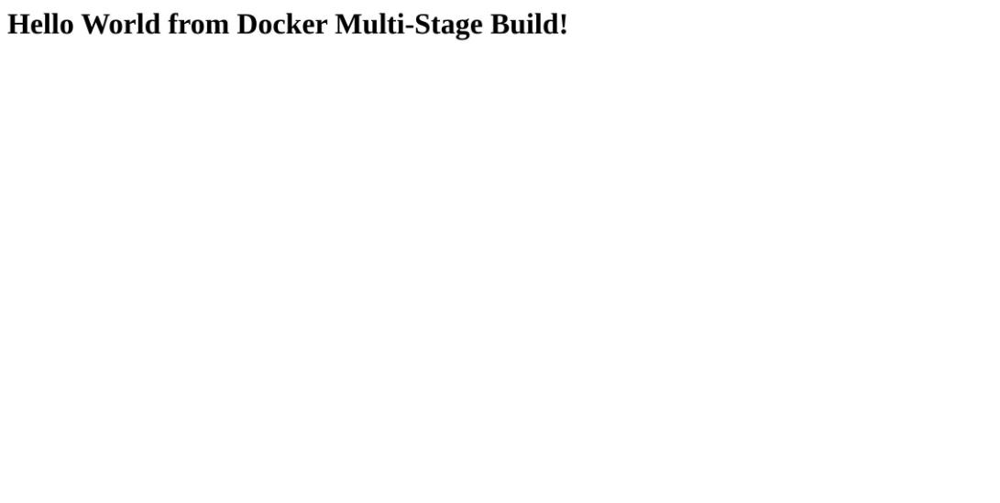

# Docker Multi-Stage Build - Submission

**Name:** Hitarth Jain
**Enrollment Number:** 24BCS10299

---

## Task 1: Run the multi-stage Dockerfile

### The Dockerfile

`multi-stage-dockerfile/Dockerfile`

```dockerfile
# Stage 1: Build
FROM node:24-alpine AS builder
WORKDIR /app
COPY package*.json ./
RUN npm install
COPY . .

# Stage 2: Production
FROM node:24-alpine AS production
WORKDIR /app
COPY --from=builder /app/package*.json ./
RUN npm install --omit=dev
COPY --from=builder /app/server.js ./
EXPOSE 3000
CMD ["npm", "start"]
```

### Build

```
$ docker build -t multi-stage-build ./multi-stage-dockerfile

#5  [builder 1/5] FROM docker.io/library/node:24-alpine
#6  [builder 2/5] WORKDIR /app
#7  [builder 3/5] COPY package*.json ./
#8  [builder 4/5] RUN npm install
#9  [builder 5/5] COPY . .
#10 [production 3/5] COPY --from=builder /app/package*.json ./
#11 [production 4/5] RUN npm install --omit=dev
#12 [production 5/5] COPY --from=builder /app/server.js ./
#13 exporting to image
#13 writing image sha256:125290746d023fa12fcb9d974bce412f1cdb40fe36f0b6e9538eea02f3d27738
#13 naming to docker.io/library/multi-stage-build done
```

### Run the container on port 8080

```
$ docker run -d --name multi-stage -p 8080:3000 multi-stage-build
5ee5d2aea948e07249ae125d185010e8b92eebd0dc6426ec6165514a4b74dfb9
```

### Application output

```
$ curl http://localhost:8080
<h1>Hello World from Docker Multi-Stage Build!</h1>
```




Verified in the browser at **http://localhost:8080** - the page shows
**Hello World from Docker multi-stage build**.

Container logs confirming the app started:

```
$ docker logs multi-stage
> node server.js

Server running on port 3000
```

### `docker ps` showing the container on port 8080

```
$ docker ps
CONTAINER ID   IMAGE               COMMAND                  STATUS              PORTS                          NAMES
5ee5d2aea948   multi-stage-build   "docker-entrypoint.s…"   Up About a minute   0.0.0.0:8080->3000/tcp         multi-stage
```

`0.0.0.0:8080->3000/tcp` - the app listens on 3000 inside the container and Docker publishes it on the host's port 8080.

---

## Task 2: Documentation

This file. Name and enrollment number at the top, build output, application output, and the `docker ps` above.

---

## Task 3: Deploy at least 3 different types of applications

Deployed six, all built and verified on this machine. Full build logs for each are in [README.md](README.md).

| # | type | folder | image | port mapping | verified output |
|---|---|---|---|---|---|
| 1 | Node.js (Express) | `nodejs-app` | nodejs-app 176MB | 3001 -> 3000 | `<h1>Hello World from Docker!</h1>` |
| 2 | Python (FastAPI) | `python-app` | python-app 165MB | 8001 -> 8000 | `<h1>Hello World from Docker!</h1>` |
| 3 | Java (HttpServer) | `java-app` | java-app 364MB | 8083 -> 8080 | `<h1>Hello World from Docker!</h1>` |
| 4 | Apache (httpd) | `Apache-app` | apache-app 117MB | 8084 -> 80 | `<h1>Hello World from Apache + Docker!</h1>` |
| 5 | React (Vite + nginx) | `React-app` | react-app 162MB | 8085 -> 80 | `Hello World from Docker!` (rendered) |
| 6 | Nginx (static) | `nginx-app` | nginx-app 162MB | 8082 -> 80 | `<h1>Hello World from Nginx + Docker!</h1>` |

All seven containers running together:

```
$ docker ps
NAMES          IMAGE               STATUS          PORTS
multi-stage    multi-stage-build   Up 15 seconds   0.0.0.0:8080->3000/tcp
hello-nginx    nginx-app           Up 16 seconds   0.0.0.0:8082->80/tcp
hello-react    react-app           Up 18 seconds   0.0.0.0:8085->80/tcp
hello-apache   apache-app          Up 18 seconds   0.0.0.0:8084->80/tcp
hello-java     java-app            Up 19 seconds   0.0.0.0:8083->8080/tcp
hello-python   python-app          Up 21 seconds   0.0.0.0:8001->8000/tcp
hello-node     nodejs-app          Up 22 seconds   0.0.0.0:3001->3000/tcp
```

### Screenshots of each app in the browser

| Node.js (:3001) | Python (:8001) |
|---|---|
|  |  |

| Java (:8083) | Apache (:8084) |
|---|---|
|  |  |

| React (:8085) | Nginx (:8082) |
|---|---|
|  |  |

### Curl output for each

```
$ curl http://localhost:3001        # Node
<h1>Hello World from Docker!</h1>

$ curl http://localhost:8001        # Python
<h1>Hello World from Docker!</h1>

$ curl http://localhost:8083        # Java
<h1>Hello World from Docker!</h1>

$ curl http://localhost:8084        # Apache
<h1>Hello World from Apache + Docker!</h1>

$ curl http://localhost:8082        # Nginx
<h1>Hello World from Nginx + Docker!</h1>

$ curl -s http://localhost:8085/assets/index-u2Cd2JyX.js | grep -o 'Hello World[^"]*'   # React
Hello World from Docker!
```

---

## Extra: measuring what multi-stage actually saves

I didn't want to just claim "multi-stage makes images smaller", so I measured it.

For this Node app the saving is small, because there is nothing to compile:

```
multi-stage-build   172MB
single-stage-build  176MB      (same app, one stage)
```

For the React app it's real. Building only the first stage and comparing:

```
$ docker build --target build -t react-buildstage ./React-app

react-buildstage  336MB    <- node + node_modules + source
react-app         162MB    <- nginx + the built dist/
```

```
$ docker run --rm react-buildstage sh -c 'du -sh /app/node_modules'
40.5M   /app/node_modules

$ docker run --rm react-app sh -c 'du -sh /usr/share/nginx/html'
156K    /usr/share/nginx/html
```

The shipped image is 156KB of static files with no Node.js in it at all. The saving is proportional to how much of the build is tooling rather than output.
